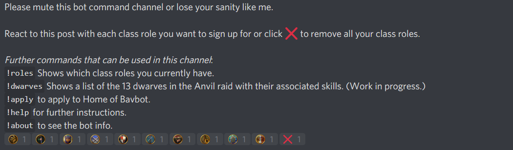

Prerequisites:\
python >= 3.6\
Check the requirements.txt file for required libraries.\
You can get them with e.g. `python3 -m pip install -U discord.py`

------------------------------------

This is a discord bot aimed at making it easy to schedule raids in a discord server. It is developed for LotRO but could work for any game if you edit the class names in the config file.

When the `!raid` command is called the bot will create an embed specifying the raid time in server time, New York's, London's and Sydney's time. Server time is configurable. The bot will add class emojis to this embed for users to interact with. When a user clicks on a class emoji it will update the embed listing the user's discord nickname and available classes. Moreover it will add tools, pickaxe, check mark and cross mark emojis. A user can sign up with all his classes by clicking the green check mark and cancel his sign up by clicking the red cross mark. The tools emoji can only be used by raid leaders to update the raid bosses, raid time or roster settings. If roster is enabled, the pickaxe emoji can be used by raid leaders to pick people for the raid from available sign ups.

The `!raid` command requires a name (of the raid) and a tier argument, which may get cumbersome.
Alternatively you can create a discord channels in your server, say `tier-2-raids` and `tier-3-raids` and use the nickname of the raid directly: `!anvil saturday 6pm`.
This command will look in the channel name for a number and uses that as tier argument.
It will expand the alias used to invoke the command as name for the raid (in this case Anvil of Winterstith).
See [list-of-raids](./source/list-of-raids.csv) for all nicknames that can be used to quickly schedule a raid.

In addition the bot will create a "role post" that allows users to sign up for mentionable class roles by interacting through class emojis. If you want to use the green check mark to sign up for raids you must sign up for your classes' roles. There is also an experimental apply feature that asks a user two standard questions. This must be configured in a separate channel from the channel used to create raids.

For a detailed explanation how to use the bot's commands please use `!help` once it is running.

Config file values:\
BOT_TOKEN: Your discord's bot token (this is not the client secret).\
CLASSES: The classes in your game. Note your discord server must have custom emojis named exactly the same. Emojis for LotRO are included, you can upload these to your discord server.\
CHANNELS: The role post will be posted to the BOT channel. This channel will be purged so do NOT use a channel with info you want to keep. (In particular do not post your raids in the BOT channel.) Any incoming applications will be posted to the APPLY channel, so this should be officer only.\
LEADER: Name of the discord role that will be allowed to update bosses and times for raid post.\
SERVER_TZ: The raid time in the header of the embed will be posted in this timezone. (Requires TZ database name)
LANGUAGE: The language of the bot. Currently only English "en" and French "fr" are supported.

See [es/messages.po](./source/locale/es/LC_MESSAGES/messages.po) if you wish to help translate to Spanish.
An example config file has been included for English and French.
If language is not set to "en", the language binary file needs to be generated by running `msgfmt.py` using `messages.po` as input to create a file `messages.mo`.

See this link how to create a bot user on discord, obtain your bot token and invite the bot to your server:
https://discordpy.readthedocs.io/en/latest/discord.html#

Please ensure the bot has the correct permissions: 268512336.

(Manage roles, manage channels, read messages, read message history, send messages, manage messages, add reactions.)

Any questions please ask in our discord server:
https://discord.gg/dGcBzPN
