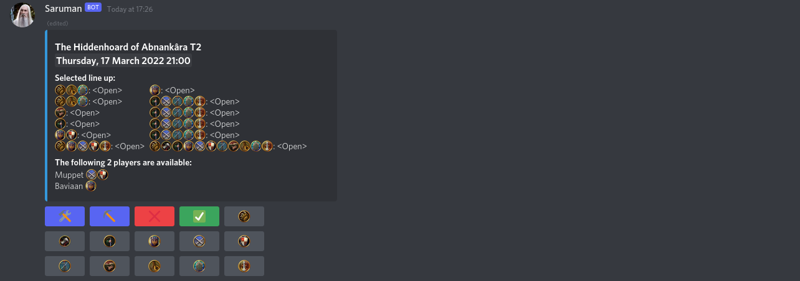

This is a discord bot aimed at making it easy to schedule raids in a discord server. It is developed for LotRO but could work for any game if you edit the class names in the config file.

When a raid command is called the bot will create an embed specifying the raid time in server time (New York), Los Angeles', London's and Sydney's time.
All time zones are configurable.
The bot will add class emojis to this embed for users to interact with.
When a user clicks on a class emoji it will update the embed, listing the user's discord nickname and available classes.
Moreover it will add tools, pickaxe, check mark and cross mark emojis.
A user can sign up with all his (previously used) classes by clicking the green check mark and cancel his sign up by clicking the red cross mark.
One can reset the classes for the green check mark sign up via the `/remove_roles` command.
The tools emoji can only be used by raid leaders to update the raid bosses, raid tier, raid time or roster settings.
The pickaxe emoji can be used by raid leaders to pick people for the raid from available sign ups.

If you would like to use the public bot please join our
[discord server](https://discord.gg/5YqSzuV)
to find the bot invite link.

If you would like to host your own instance, continue reading below.

------------------------------------

Prerequisites:\
python >= 3.8\
Check the requirements.txt file for required libraries.\
You can get all of them with: `python3 -m pip install -U -r requirements.txt`, assuming requirements.txt is in your current directory.

See details further below how to specify your configuration file and then simply run with `python3 main.py`

------------------------------------
**Instructions for Windows.**\
Python does not come pre-installed on Windows so you will need to install it yourself. Go to https://www.python.org/downloads/ and click the big yellow button to download Python 3.9. Simply run the downloaded file to install Python. Now to save yourself a world of pain, BEFORE you click the 'Install Now' button, make sure you check the box **'Add Python 3.9 to PATH'**. This will allow you to use the python command in your terminal (command prompt).

To check installation was successful open a terminal and type `python --version`, it will return (as of writing) Python 3.9.6, assuming you do not have Python 2 installed.
(Search for cmd and press enter to open a terminal.)
Download the latest release from https://github.com/Baviaan/lotro/releases/latest by clicking on the zip version and extract the folder on your computer.
In your terminal change directory to wherever you extracted the files.
(For example type `cd Desktop\lotro-5.0.0` if you downloaded version 5.0.0 and extracted the folder to your desktop.)
Now you can install the required Python libraries with `python -m pip install -U -r requirements.txt`.
Before you run the bot you will need to edit your configuration file.
See below for further instructions what to put in the configuration file.
Once you are done you can run the bot by typing `python main.py` in your terminal.

------------------------------------

You will need to make a copy of the 'example-config.json' file, name it 'config.json' and specify your configuration values.
(Windows might complain it doesn't know how to open json files, but simply select to open it with notepad and it'll work fine.)
See below for a guide how to create a discord bot.

Config file values:\
BOT_TOKEN: Your discord's bot token (this is not the client secret).\
CLASSES: The classes in your game. Note your discord server must have custom emojis named exactly the same. Emojis for LotRO are included, you can upload these to your discord server.\
LANGUAGE: The language of the bot. Currently only English "en" and French "fr" are supported.\
LINEUP: A sequence of zeroes and ones indicating for each slot whether the class should be present, in the order as specified under CLASSES. This will **ABSOLUTELY BREAK THE UI** if you specify too many ones. Please contain yourself.\
SERVER_TZ: The raid time in the header of the embed will be posted in this time zone. (Requires TZ database name.)\
PREFIX: The prefix that will be used to start a command. (legacy)

See [es/messages.po](./source/locale/es/LC_MESSAGES/messages.po) if you wish to help translate to Spanish.
An example config file has been included for English and French.
**If language is not set to "en", the language binary file needs to be generated by running `msgfmt.py` using `messages.po` as input to create a file `messages.mo`.**

------------------------------------

See this link how to create a bot user on discord, obtain your bot token and invite the bot to your server:
https://discordpy.readthedocs.io/en/latest/discord.html#

Please ensure the bot has the correct permissions: 268724304.

(Manage roles, manage channels, send messages, manage messages, embed links, use external emoji, add reactions.)

Please note the bot will automatically shut down if it is not in any discord servers.

------------------------------------

Any questions please ask in our discord server, invite code: `dGcBzPN`\
You can paste the code directly in the discord app when clicking the join server button.

------------------------------------

## Command overview

### Configuration commands
| Command | Requirement | Example | Notes |
| ------- |:-----------:| ------- | ----- |
| **/leader** \<role\>| Admin | /leader Officer | Specify "Raid Leader" role. Raid leaders can edit raids posted by others. |
| **/time_zones server** \<timezone\> | Raid Leader | /time_zones server europe/paris | Set to US Eastern by default. This timezone is the default timezone for interpretation of raid commands. |
| **/kin** \<role\>| Admin | /kin Kin | Specify "kin" role. If specified kin members will be marked on the sign up sheet. |

### Scheduling commands

| Command | Example | Notes |
| ------- | ------- | ----- |
| **/calendar** | /calendar | Provides an overview of all scheduled runs for the upcoming week, with direct links to the raid posts. This command will only have to be run once as the calendar will automatically populate with new runs. |
| **/\<raid_name\>** \<tier\> \<time\> | /rem t2 tomorrow 8pm, /ad t3 friday 8pm | Fastest way to schedule a raid. |
| **/custom** \<name\> \<time\> \[tier\] | /custom my big event friday 8pm | Schedules a custom event. Tier argument is optional. |
| **/list_players** | /list_players | Lists the signed up players for a raid in order of sign up time. |

### User specific commands
| Command | Example | Notes |
| ------- | ------- | ----- |
| **/remove_roles** | /remove_roles | Removes the class roles you have. |
| **/time_zones personal** \<timezone\> | /time_zones personal europe/london | Set to server time by default. This timezone is used to interpret *your* raid commands. |

### Info commands

| Command | Notes |
| ------- | ----- |
| **/server_time** | Returns the current server time. |
| **/events** | Returns the upcoming official LotRO events. |
| **/about** | Shows some basic information about the bot. |

### Miscellaneous commands
| Command | Notes |
| ------- | ----- |
| **/privacy** | Displays information on data collection and retention. |
| **/welcome** | Resends the welcome message. |
